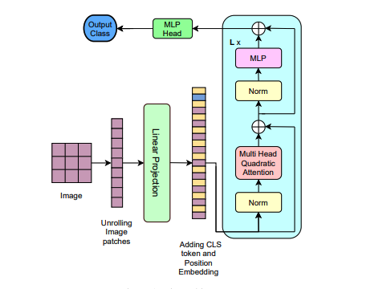
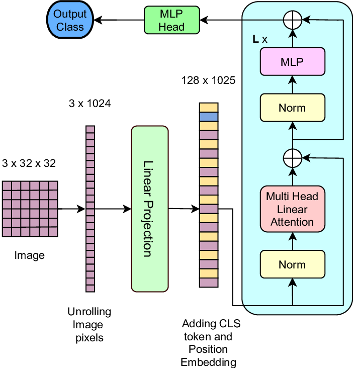
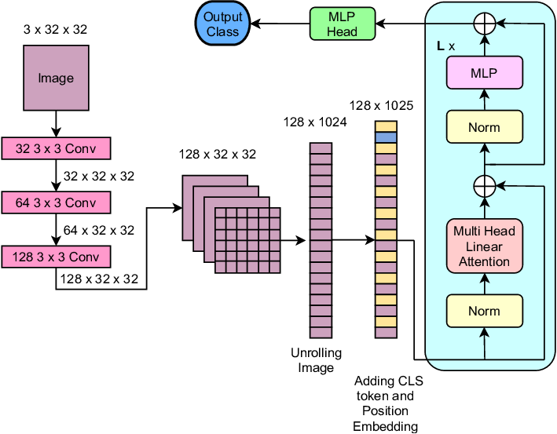
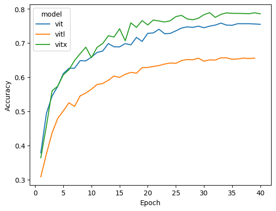
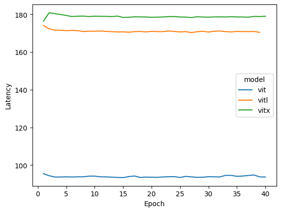

This repository is an implementation of Vision Transformer(VIT) with different attention mechanisms and image feature extraction methods.

+ Dot Product Attention VS Linear Attention
+ CNN Projection VS Linear Projection

## Readings

+ [An Image is Worth 16x16 Words: Transformers for Image Recognition at Scale](https://arxiv.org/abs/2010.11929)
+ [Vison Xformers](https://arxiv.org/pdf/2107.02239v4)
+ [Linear Transformer](https://arxiv.org/pdf/2006.16236)
+ [Performers](https://arxiv.org/pdf/2009.14794)
+ [FlashAttention](https://arxiv.org/pdf/2205.14135)
+ [Attention is all you need](https://arxiv.org/pdf/1706.03762)

## Dataset

+ CIFAR10
+ Training Set: 50,000
+ Test Set: 10,000

## Device

+ MPS(M1 Pro)

## Vision Transformer(VIT)

+ Image Feature Extraction: Linear Projection
+ Attention: Scaled Dot Product Attention
+ Image Size: 32x32
+ Dimension: 128
+ Patch Size: 2x2
+ Number of Patches: 16*16
+ Attention Heads: 8
+ Attention Block: 4
+ Attention Dimension: 128
+ Parameters: 829,322
+ Top 1 Accuracy on CIFAR10: 75.83%
+ Training Time: 93.9s/epoch
+ how to try?
  + `python train.py --model vit --epochs 40 --lr 1e-3 --device mps(or cuda) --batch_size 128 --logging_step 50 --img_size 32`

## Vision Transformer with Linear Attention(VITL)

+ Image Feature Extraction: Linear Projection
+ Attention: Linear Attention
+ Image Size: 32x32
+ Dimension: 128
+ Patch Size: 1X1
+ Number of Patches: 32*32
+ Attention Heads: 8
+ Attention Block: 4
+ Attention Dimension: 128
+ Parameters: 924,426
+ Top 1 Accuracy on CIFAR10: 65.58%
+ Training Time: 171.1s/epoch
+ how to try?
  + `python train.py --model vitl --epochs 40 --lr 1e-3 --device mps(or cuda) --batch_size 128 --logging_step 50 --img_size 32`

## Vision Transformer with CNN Projection(VITX)

+ Image Feature Extraction: CNN
+ Attention: Linear Attention
+ Image Size: 32x32
+ Dimension: 128
+ Patch Size: None
+ Number of Patches: None
+ Attention Heads: 8
+ Attention Block: 4
+ Attention Dimension: 128
+ Parameters: 1,017,162
+ Top 1 Accuracy on CIFAR10: 78.89%
+ Training Time: 178.8s/epoch
+ how to try?
  + `python train.py --model vitx --epochs 40 --lr 1e-3 --device mps(or cuda) --batch_size 128 --logging_step 50 --img_size 32`

## Model Comparison

| Metric | VIT | VITL | VITX |
|--------|-----|------|------|
| Image Feature Extraction | Linear Projection | Linear Projection | CNN |
| Attention | Scaled Dot Product | Linear | Linear |
| Image Size | 32x32 | 32x32 | 32x32 |
| Dimension | 128 | 128 | 128 |
| Patch Size | 2x2 | 1x1 | None |
| Number of Patches | 16x16 | 32x32 | None |
| Attention Heads | 8 | 8 | 8 |
| Attention Blocks | 4 | 4 | 4 |
| Attention Dimension | 128 | 128 | 128 |
| Parameters | 829,322 | 924,426 | 1,017,162 |
| Top 1 Accuracy (CIFAR10) | 75.83% | 65.58% | 78.89% |
| Training Time (per epoch) | 93.9s | 171.1s | 178.8s |

## Accuracy Curve

## Training Latency Curve

